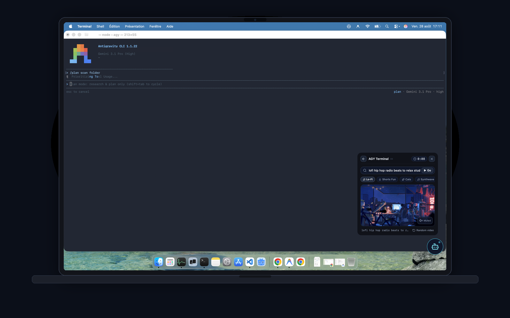
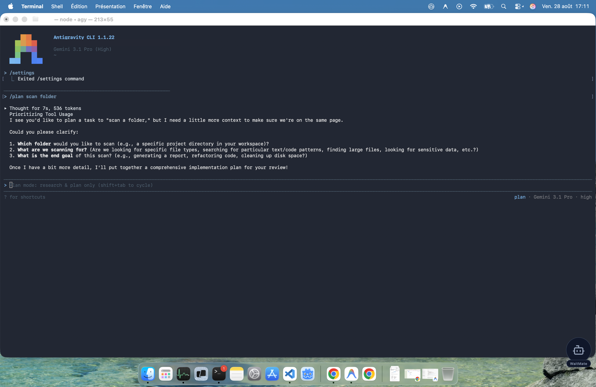
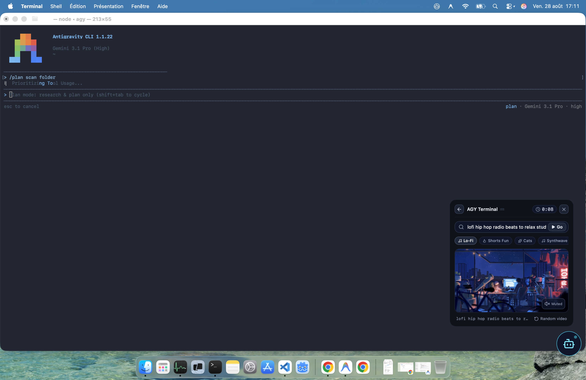
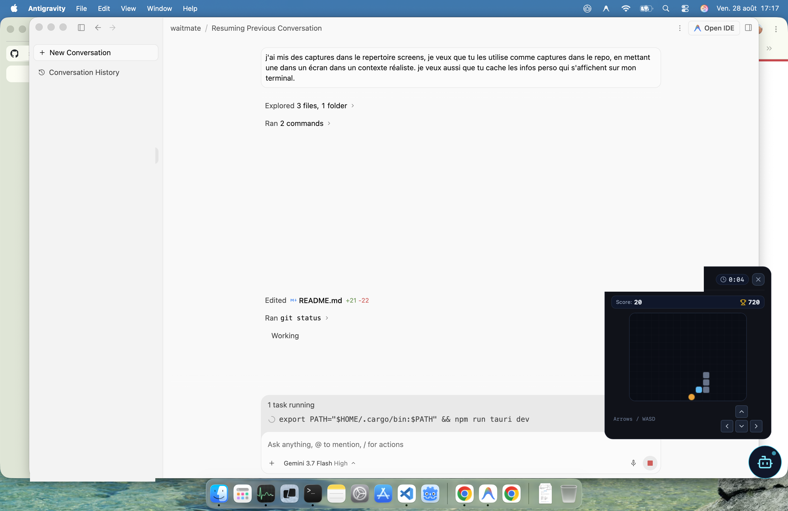

<h1 align="center">🤖 WaitMate</h1>

<p align="center">
  <strong>The floating desktop companion that turns AI waiting times into focused micro-breaks.</strong>
</p>

<p align="center">
  
  
  
  
  
</p>

## Screenshots

<div align="center">
  
</div>

<br />

<div align="center">
  <table>
    <tr>
      <td align="center" width="33%">
        
      </td>
      <td align="center" width="33%">
        
      </td>
      <td align="center" width="33%">
        
      </td>
    </tr>
  </table>
</div>

---

## 💡 Why WaitMate?

When working with modern LLMs and agentic coding tools (**Antigravity**, **Claude Code**, **Ollama**, **Aider**), developers spend dozens of 15–60 second intervals waiting for answers, tool executions, and file diffs. 

Context-switching to a browser tab or social media destroys flow state. **WaitMate** stays discretely on your screen:
- **Calm & Compact in Idle** (160×160 px circle in the corner of your screen).
- **Auto-Deploys in Milliseconds** as soon as your AI starts thinking.
- **Auto-Retracts Instantly** with zero delay the exact moment your answer is ready.

---

## ✨ Features

### 1. 🔍 Zero-Config Universal AI Detection
- **Native Antigravity & `agy` Watcher**: High-frequency real-time transcript monitoring (`120ms`) covering both the Antigravity IDE and the `agy` terminal CLI.
- **CLI Process Scanner**: Automatically detects active terminal AI commands including `claude`, `ollama run`, `aider`, `gemini`, `llm`, and `sgpt`.
- **Universal CLI Wrapper (`wm`)**: Prefix *any* custom terminal script or command with `wm` (e.g. `wm python script.py`, `wm curl ...`) to trigger WaitMate during execution.
- **Zsh Shell Hook**: Seamless `preexec`/`precmd` hook integration for zero-effort shell triggering.
- **HTTP Webhook API**: Simple local REST endpoint on port `9999` (`POST /start` & `POST /stop`).

### 2. 🐍 Snake Arcade
- Responsive 2D retro canvas game with fluid controls (Arrow keys, `WASD`, `ZQSD`, or on-screen D-Pad).
- Golden bonus apples (+30 pts), score multipliers, and persistent high-score tracking.

### 3. 📺 Ambient YouTube Player
- Type any keyword (e.g. `lofi`, `cats`, `f1`, `synthwave`, `gaming`) to launch a randomized ambient video.
- **Anti-Repetition Engine**: Automatically excludes your last 50 viewed videos and diversifies search terms to guarantee a fresh video every time.
- **Muted by Default**: Videos start silently so your music or environment isn't interrupted; toggle sound anytime with one click.
- **Distraction-Free**: Player controls and interactive overlays are disabled for a clean, TV-like experience.

### 4. 🪶 Minimalist & Native macOS UX
- Transparent, frameless window with **Always-on-Top** support.
- Fully draggable anywhere across your displays.
- Automatic window focus upon expansion so you can immediately play with keyboard shortcuts without clicking first.
- Matte obsidian aesthetic without fluorescent halos or distracting animations.

---

## 🚀 Getting Started

### Prerequisites
- [Node.js](https://nodejs.org/) (v18+)
- [Rust & Cargo](https://rustup.rs/) (v1.75+)

### Clone & Install

```bash
# Clone the repository
git clone https://github.com/ndaden/waitmate.git
cd waitmate

# Install frontend dependencies
npm install

# Run in development mode
npm run tauri dev
```

### Build for Production

```bash
# Build standalone macOS .app & .dmg
npm run tauri build
```

---

## 🐚 Terminal Integration

### 1. Universal `wm` CLI Wrapper
A standalone wrapper script is provided in `~/.local/bin/wm`:

```bash
# Run any CLI AI or command with WaitMate
wm ollama run llama3 "Explain quantum computing"
wm claude "Add unit tests to src/watcher.rs"
wm python my_agent.py
```

### 2. Zsh Hook (Optional)
Add this line to your `~/.zshrc` to automatically detect recognized AI commands on `Enter`:

```bash
echo 'source ~/.config/waitmate/waitmate.zsh' >> ~/.zshrc
source ~/.zshrc
```

### 3. HTTP Webhook API
You can also trigger WaitMate from any script or editor plugin:

```bash
# Start WaitMate
curl -X POST http://127.0.0.1:9999/start \
  -H "Content-Type: application/json" \
  -d '{"model": "Claude", "prompt": "Refactoring components..."}'

# Stop WaitMate
curl -X POST http://127.0.0.1:9999/stop \
  -H "Content-Type: application/json" \
  -d '{"success": true}'
```

---

## 🛠️ Tech Stack

- **Framework**: [Tauri v2](https://tauri.app/) (Rust backend)
- **Frontend**: [React 19](https://react.dev/), [TypeScript](https://www.typescriptlang.org/), [Vite](https://vitejs.dev/)
- **Styling**: [Tailwind CSS v4](https://tailwindcss.com/)
- **Icons & Effects**: [Lucide React](https://lucide.dev/), [Canvas Confetti](https://github.com/catdad/canvas-confetti)
- **System Monitoring**: `sysinfo` crate for low-overhead process tracking

---

## 📄 License

This project is open source and available under the [MIT License](LICENSE).
